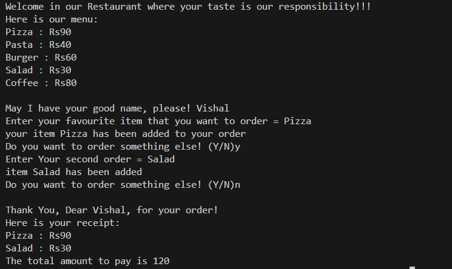

# Cafe Management App Using Python

With this application, you can conveniently order your favorite dish. The system will then inquire if you would like to add any additional items to your order. Upon completion, it will generate a detailed bill with the total amount calculated. This application is developed using Python.

<h5>Please find a showcase of our application in the screenshot provided below."</h5>
